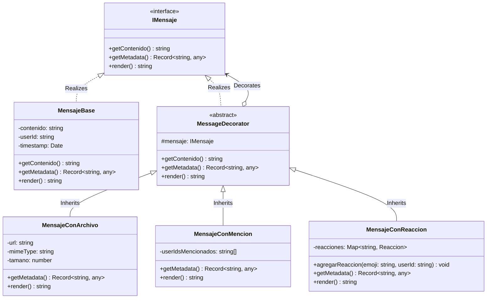
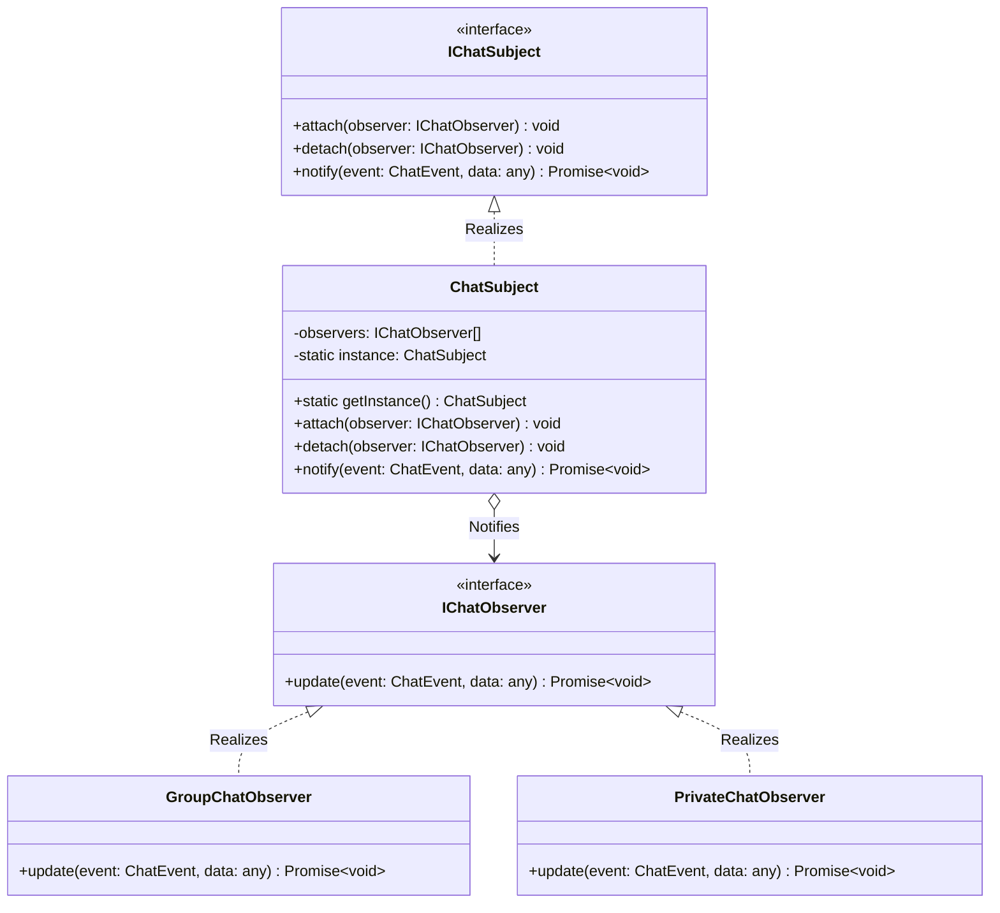

# Módulo de Chat - Patrones Decorator & Observer

Este módulo implementa dos patrones de diseño fundamentales para lograr una arquitectura de mensajería altamente flexible, desacoplada y escalable: el patrón estructural **Decorator** para enriquecer los mensajes y el patrón de comportamiento **Observer** para la mensajería en tiempo real.

---

## 1. Patrón Structural Decorator (Composición de Mensajes)

El patrón **Decorator** permite componer y ampliar las capacidades de los mensajes de chat de manera dinámica y flexible sin modificar su implementación interna.

### Componentes Clave:
1. **`IMensaje`**: Interfaz común que define el contrato de comportamiento para todos los componentes de mensaje (`getContenido()`, `getMetadata()`, `render()`).
2. **`MensajeBase`**: El componente concreto base. Representa un mensaje de texto plano con información del remitente (`userId`) y marca de tiempo (`timestamp`).
3. **`MessageDecorator`**: Clase decoradora abstracta que mantiene una referencia al objeto `IMensaje` decorado y delega las llamadas de forma transparente.
4. **`MensajeConArchivo`**: Decorador concreto que añade soporte para adjuntos (URL, tipo MIME y tamaño en bytes) y amplía la salida de `render()` y `getMetadata()`.
5. **`MensajeConMencion`**: Decorador concreto que permite registrar usuarios mencionados y resalta visualmente en la salida renderizada (`<span class="mention">@userId</span>`).
6. **`MensajeConReaccion`**: Decorador concreto que gestiona las reacciones de los usuarios agregando y renderizando badges interactivos.

### Diagrama UML de Clases (Decorator)


---

## 2. Patrón Behavioral Observer (Mensajería en Tiempo Real)

El patrón **Observer** se utiliza para desacoplar el flujo de persistencia de mensajes del envío en vivo por WebSockets, permitiendo notificar de forma independiente a canales grupales y privados.

### Catálogo de Eventos (`ChatEvent`):
* **`NUEVO_MENSAJE`**: Emitido cuando se crea un nuevo mensaje en el sistema (grupal o privado), llevando consigo el mensaje ya completamente decorado.

### Componentes Clave:
1. **`IChatSubject`**: Interfaz común que define los métodos `attach()`, `detach()` y `notify()`.
2. **`ChatSubject`**: Implementación Singleton central del subject que emite los eventos tipados de mensajería.
3. **`GroupChatObserver`**: Observer concreto responsable de propagar mensajes grupales en vivo utilizando el canal de sala del grupo correspondiente (`group-${groupId}`).
4. **`PrivateChatObserver`**: Observer concreto e independiente responsable de notificar los mensajes privados de forma aislada a los sockets de los dos usuarios participantes (`user-${userId}`), evitando la mezcla de eventos o filtraciones.

### Diagrama UML de Clases (Observer)


---

## 3. Ejemplo de Uso de los Patrones Combinados

### Composición de Decoradores:
```typescript
let mensaje = new MensajeBase("Hola @user123, adjunto la tarea :)", "user123", new Date());
mensaje = new MensajeConArchivo(mensaje, "/uploads/tarea.pdf", "application/pdf", 10245);
mensaje = new MensajeConMencion(mensaje, ["user123"]);
```

### Notificación mediante el Observer:
```typescript
// Notificar a todos los observers registrados automáticamente en tiempo real
const chatSubject = ChatSubject.getInstance();
chatSubject.notify('NUEVO_MENSAJE', {
  isPrivate: false,
  message: mensajeDecoradoDTO
});
```
