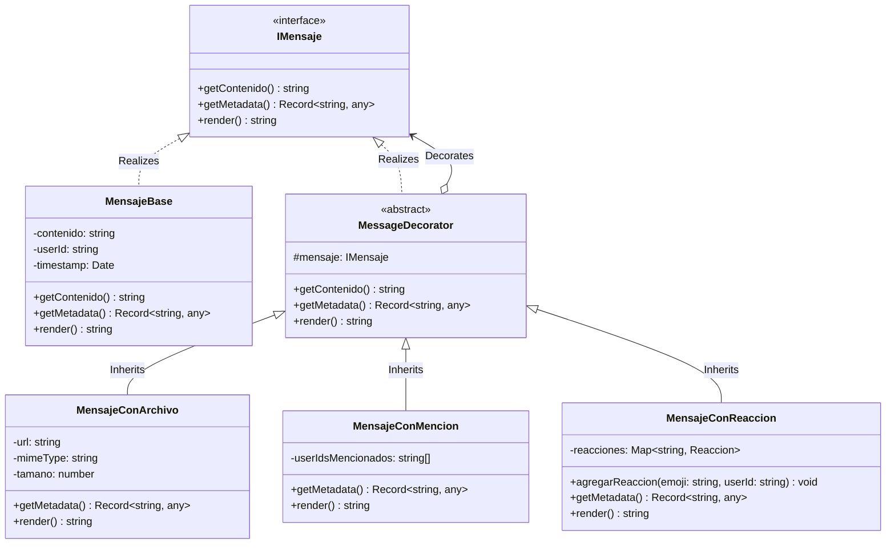

# Módulo de Chat - Patrón Decorator

Este módulo implementa el patrón de diseño estructural **Decorator** para componer y ampliar las capacidades de los mensajes de chat de manera dinámica y flexible. Esto permite añadir soporte para adjuntos, menciones y reacciones sobre la clase base de mensaje sin modificar su implementación interna ni violar el principio de Abierto/Cerrado (Open/Closed Principle).

---

## 1. Diseño del Patrón Decorator

### Componentes Clave:
1. **`IMensaje`**: Interfaz común que define el contrato de comportamiento para todos los componentes de mensaje (`getContenido()`, `getMetadata()`, `render()`).
2. **`MensajeBase`**: El componente concreto base. Representa un mensaje de texto plano con información del remitente (`userId`) y marca de tiempo (`timestamp`).
3. **`MessageDecorator`**: Clase decoradora abstracta que mantiene una referencia al objeto `IMensaje` decorado y delega las llamadas de forma transparente.
4. **`MensajeConArchivo`**: Decorador concreto que añade soporte para adjuntos (URL, tipo MIME y tamaño en bytes) y amplía la salida de `render()` y `getMetadata()`.
5. **`MensajeConMencion`**: Decorador concreto que permite registrar usuarios mencionados y resalta visualmente en la salida renderizada (`<span class="mention">@userId</span>`).
6. **`MensajeConReaccion`**: Decorador concreto que gestiona las reacciones de los usuarios agregando y renderizando badges interactivos.

---

## 2. Diagrama UML de Clases

A continuación se muestra el diseño estructurado del patrón utilizando la sintaxis de Mermaid UML:



---

## 3. Ejemplo de Uso Componible

Los decoradores son totalmente componibles. Se puede construir un mensaje que incluya archivo, menciones y reacciones de la siguiente manera:

```typescript
import {
  MensajeBase,
  MensajeConArchivo,
  MensajeConMencion,
  MensajeConReaccion
} from './decorators/imessage.decorator';

// 1. Crear el mensaje plano base
let mensaje = new MensajeBase("Hola @user123, adjunto la tarea :)", "user123", new Date());

// 2. Agregar un archivo adjunto
mensaje = new MensajeConArchivo(mensaje, "/uploads/tarea.pdf", "application/pdf", 10245);

// 3. Registrar mención a un usuario
mensaje = new MensajeConMencion(mensaje, ["user123"]);

// 4. Agregar interacción social (reacciones)
const mensajeSocial = new MensajeConReaccion(mensaje);
mensajeSocial.agregarReaccion("❤️", "user456");
mensajeSocial.agregarReaccion("👍", "user789");

// 5. Consumir los resultados
console.log(mensajeSocial.render());
console.log(mensajeSocial.getMetadata());
```
