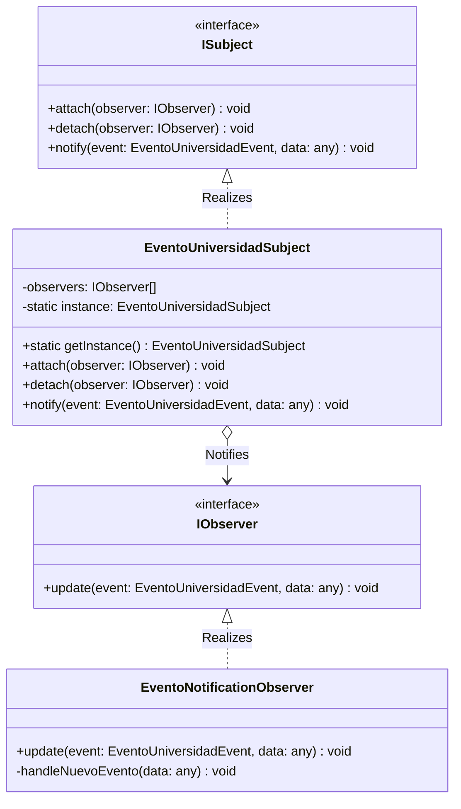

# Módulo de Eventos Universitarios - Patrón Observer

Este módulo implementa el patrón de diseño de comportamiento **Observer** para gestionar suscripciones de estudiantes a categorías de eventos de UniConnect y emitir notificaciones segmentadas en tiempo real.

---

## 1. Diseño del Patrón Observer de Eventos

El diseño permite que los estudiantes gestionen sus preferencias de notificación suscribiéndose a categorías específicas (`ACADEMICO`, `CULTURAL`, `DEPORTIVO`, `TECNOLOGIA`, `OTRO`). Al publicarse un nuevo evento, el sistema notifica en exclusiva a los estudiantes interesados.

### Catálogo de Eventos (`EventoUniversidadEvent`):
* **`NUEVO_EVENTO`**: Emitido al publicarse un nuevo evento, incluyendo en su payload la categoría y los metadatos relevantes para la distribución.

### Componentes Clave:
1. **`ISubject`**: Interfaz común que define los métodos de suscripción y despacho (`attach()`, `detach()`, `notify()`).
2. **`EventoUniversidadSubject`**: Implementación Singleton central del subject de eventos universitarios.
3. **`EventoNotificationObserver`**: Observer concreto que captura el evento `NUEVO_EVENTO`, consulta en base de datos las suscripciones vigentes para esa categoría, y emite de forma filtrada las alertas persistentes y los eventos WebSocket (`new-notification`) únicamente a los estudiantes interesados.

---

## 2. Diagrama UML de Clases y Flujo

A continuación se detalla la arquitectura del patrón utilizando la sintaxis de Mermaid UML:



---

## 3. Endpoints de Suscripción

Los estudiantes pueden controlar sus suscripciones utilizando los siguientes endpoints (compatibles con rutas en inglés y español):

* **Suscripción a una Categoría:**
  * **Endpoint:** `POST /eventos/suscribir` o `POST /events/subscribe`
  * **Cuerpo (JSON):**
    ```json
    {
      "category": "Academico"
    }
    ```
  * **Comportamiento:** Realiza una normalización automática a mayúsculas (`ACADEMICO`) y registra la preferencia en base de datos.

* **Desuscripción de una Categoría:**
  * **Endpoint:** `DELETE /eventos/suscribir` o `DELETE /events/subscribe/:category`
  * **Cuerpo/Query (JSON o URL):** Soporta el envío de la categoría en el body, en la URL (`/suscribir/Academico`), o como query parameter (`?category=Academico`).
  * **Comportamiento:** Remueve la preferencia del usuario en base de datos de manera limpia.
