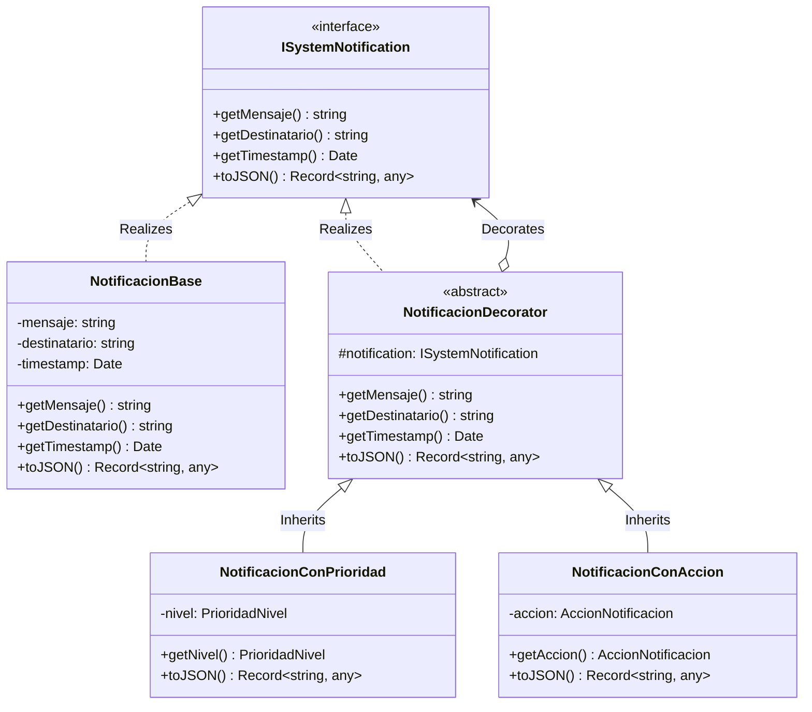

# Módulo de Notificaciones - Patrón Decorator

Este módulo implementa el patrón de diseño estructural **Decorator** para componer dinámicamente notificaciones con prioridad y acciones embebidas (Call to Action). Esto permite mantener una clase base ligera y limpia, agregando capas adicionales de información solo cuando sea necesario, sin acoplar responsabilidades y garantizando total compatibilidad con el sistema de base de datos actual.

---

## 1. Diseño del Patrón Decorator

### Componentes Clave:
1. **`ISystemNotification`**: Interfaz común que define el contrato de comportamiento para todas las notificaciones (`getMensaje()`, `getDestinatario()`, `getTimestamp()`, `toJSON()`).
2. **`NotificacionBase`**: El componente base concreto. Representa una notificación con mensaje, destinatario y timestamp.
3. **`NotificacionDecorator`**: Clase decoradora abstracta que mantiene una referencia al objeto `ISystemNotification` decorado.
4. **`NotificacionConPrioridad`**: Decorador concreto que añade un nivel de prioridad (`normal`, `urgente`, `critica`) a la notificación.
5. **`NotificacionConAccion`**: Decorador concreto que añade un objeto de acción interactiva (`label`, `endpoint`) permitiendo resolver peticiones directamente.

---

## 2. Diagrama UML de Clases

A continuación se muestra el diseño estructurado utilizando Mermaid UML:



---

## 3. Componibilidad de Notificaciones

Las notificaciones pueden ser decoradas libremente para formar combinaciones complejas. Por ejemplo:

```typescript
import {
  NotificacionBase,
  NotificacionConPrioridad,
  NotificacionConAccion
} from './decorators/notification.decorator';

// 1. Notificación base
let notificacion = new NotificacionBase("Solicitud de ingreso enviada", "user_123");

// 2. Decorada con Prioridad
notificacion = new NotificacionConPrioridad(notificacion, "urgente");

// 3. Decorada con Acción Call-To-Action
notificacion = new NotificacionConAccion(notificacion, {
  label: "Aceptar",
  endpoint: "/groups/join/1"
});

// Consumo final del JSON compuesto
console.log(notificacion.toJSON());
```
