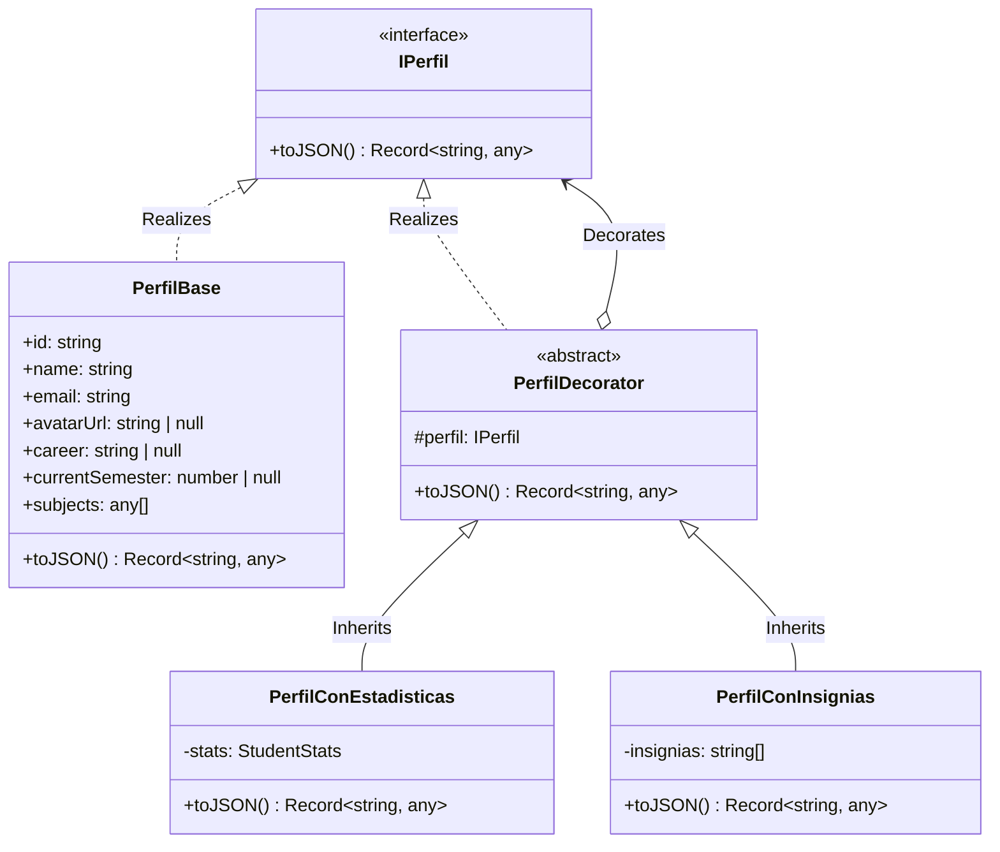

# Módulo de Estudiantes - Patrón Decorator para Perfiles

Este módulo implementa el patrón de diseño estructural **Decorator** para componer dinámicamente la información de perfil de un estudiante. Esto permite enriquecer de manera no invasiva la representación base de un estudiante con métricas/estadísticas de uso y con insignias desbloqueadas según hitos del sistema, evitando acoplar estas responsabilidades y reduciendo el costo de consulta para las peticiones simples.

---

## 1. Diseño del Patrón Decorator

### Componentes Clave:
1. **`IPerfil`**: Interfaz común que define el contrato de comportamiento para todas las versiones de representación del estudiante (`toJSON()`).
2. **`PerfilBase`**: El componente concreto base. Contiene los datos esenciales y ligeros del estudiante: nombre, carrera, semestre actual y asignaturas activas.
3. **`PerfilDecorator`**: Clase decoradora abstracta que mantiene una referencia al objeto `IPerfil` decorado y delega las operaciones.
4. **`PerfilConEstadisticas`**: Decorador concreto que añade métricas del sistema: número de grupos creados, participación en grupos y mensajes enviados en el chat.
5. **`PerfilConInsignias`**: Decorador concreto que añade un listado de badges desbloqueados dinámicamente en función de hitos del sistema alcanzados por el estudiante.

---

## 2. Diagrama UML de Clases

A continuación se detalla la estructura del patrón utilizando sintaxis Mermaid UML:

---

## 3. Endpoints Implementados

El patrón se consume a través de los siguientes endpoints:

1. **`GET /perfil/:id`**: Retorna únicamente la información del **`PerfilBase`**. Esto evita cualquier costo computacional innecesario en la base de datos (como contar mensajes y grupos) para consultas simples.
2. **`GET /perfil/:id?vista=completa`**: Retorna el perfil enriquecido combinando todos los decoradores (**`PerfilBase`** + **`PerfilConEstadisticas`** + **`PerfilConInsignias`**) de forma totalmente transparente y componible.
