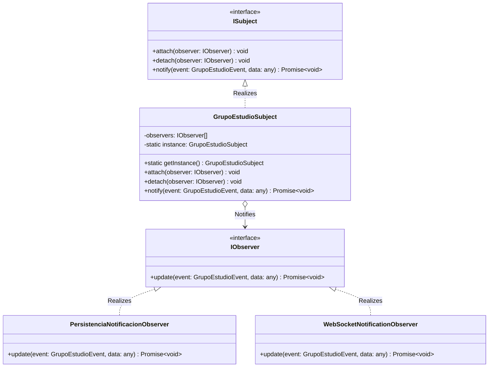

# Módulo de Grupos de Estudio - Patrón Observer

Este módulo implementa el patrón de diseño de comportamiento **Observer** para gestionar, persistir y notificar en tiempo real todos los eventos significativos dentro de los grupos de estudio de UniConnect.

---

## 1. Diseño del Patrón Observer

El diseño separa limpiamente la detección de acciones dentro de los grupos, de la persistencia histórica en base de datos y la notificación en tiempo real vía WebSockets.

### Catálogo de Eventos Tipados (`GrupoEstudioEvent`):
* **`SOLICITUD_INGRESO`**: Un estudiante solicita unirse al grupo de estudio.
* **`MIEMBRO_ACEPTADO`**: La solicitud de unión del estudiante fue aprobada.
* **`MIEMBRO_RECHAZADO`**: La solicitud de unión del estudiante fue denegada.
* **`TRANSFERENCIA_ADMIN_SOLICITADA`**: Se solicita traspasar la propiedad del grupo a otro miembro.
* **`TRANSFERENCIA_ADMIN_ACEPTADA`**: La transferencia de administración ha sido aceptada y completada.

### Componentes Clave:
1. **`ISubject`**: Interfaz que define los métodos para agregar, remover y notificar a los observers (`attach()`, `detach()`, `notify()`).
2. **`GrupoEstudioSubject`**: Implementación Singleton centralizada que emite los eventos.
3. **`PersistenciaNotificacionObserver`**: Observer concreto responsable de crear el registro de la notificación en la base de datos PostgreSQL utilizando Prisma para garantizar trazabilidad.
4. **`WebSocketNotificationObserver`**: Observer concreto responsable de empujar la señal por WebSockets (`emitToUser`) de forma instantánea al socket del destinatario, permitiendo ver la campana en tiempo real sin recargas.

---

## 2. Diagrama UML de Clases y Flujo

A continuación se detalla la arquitectura de las clases implementada utilizando la sintaxis de Mermaid UML:



---

## 3. Registro Automático

Los observers se registran automáticamente en el subject al inicializar el módulo de grupos dentro de `backend/src/modules/study-group/observers/index.ts`:

```typescript
const grupoEstudioSubject = GrupoEstudioSubject.getInstance();
grupoEstudioSubject.attach(new PersistenciaNotificacionObserver());
grupoEstudioSubject.attach(new WebSocketNotificationObserver());
```
Esto asegura que tanto la persistencia histórica en Neon Postgres como la propagación en vivo por WebSockets queden totalmente operativas desde el primer milisegundo de arranque del servidor.
